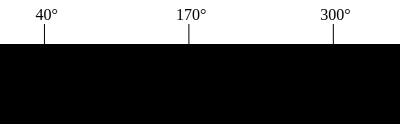
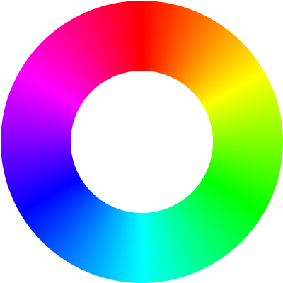
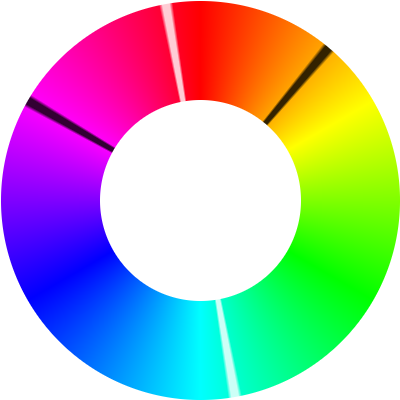
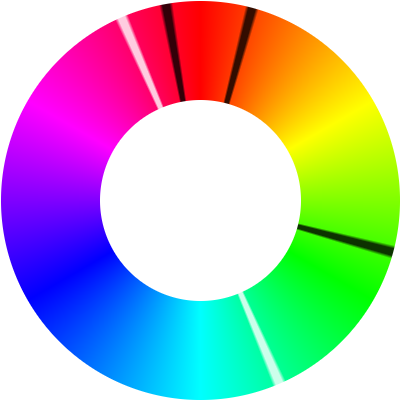

+++
date = "2023-01-01T00:00:00Z"
description = "Averaging hues is weird"
tags = ["programming"]
title = "Averaging hues"
draft = true
toc = 1
+++

Recently I needed some software to be able to average some [HSL](https://en.wikipedia.org/wiki/HSL_and_HSV) hues to find the hue in between them. My first attempt was simple: just treat the hues as a number from 0° to 360° and average them. This did not work as I expected. I ended up taking a [circular mean](https://en.wikipedia.org/wiki/Circular_mean); this post will explain what that is.

Here's what a naive arithmetic mean would look like for averaging 40° and 300°. The average of two numbers is always equidistant between those two numbers, so the average sits right in the middle of the two averaged numbers:



That averaged color doesn't look right. We averaged <span style="color: hsl(40deg, 70%, 33%)">orange</span> and <span style="color: hsl(300deg, 70%, 33%)">magenta</span>, but got a <span style="color: hsl(170deg, 70%, 33%)">greenish cyan</span>. Something like <span style="color: hsl(350deg, 65%, 50%)">red</span> would have been a better in-between color.

## The color wheel

The issue with our averaging scheme is that it treats colors on the left and right side as being far apart, when in reality the color line loops around. It's really a wheel:



## A simple way for averaging 2 hues
There's a simple way for finding a good average of 2 hues, but it doesn't work for more than two:

<details>
<summary>Expand</summary>

On a wheel, there are *two* equidistant points from the two averaged numbers, shown in white. The one on the top of the circle is closer to the two inputs, and the other one is further from the two inputs. Here, the two averaged numbers are plotted in black, and the averages in white:

<div id="observablehq-twoHueWheel-47b658f5"></div>
<div id="observablehq-viewof-pieP1-47b658f5"></div>
<div id="observablehq-viewof-pieP2-47b658f5"></div>
<noscript>
  
</noscript>

The calculation for the two averages is simple: we can find one the usual way, by taking the average of the hues:

```js
function simpleAvg(p1, p2) {
  return (p1 + p2) / 2 }
```

And rotate the first average by 180° to get the second one:

```js
function oppositeAvg(p1, p2) {
  return (simpleAvg(p1, p2) + 180) % 360 }
```
We can use select of the two averages is closest to the points to use as our average hue.

</details>
<br>

## More than 2 hues

Here's a color wheel with three values (in black) to average:



The two values in white are derived from the arithmetic average of all three hues. None of them look right.

We can take a [circular mean](https://en.wikipedia.org/wiki/Circular_mean) to find a hue that does look right. Here's the process for finding one:

<div id="explainer-area">
  <div>
    <div id="observablehq-nCircExplainer-b1c5a5c2"></div>
    <div id="observablehq-nCircStyle-b1c5a5c2"></div>
    <noscript>
      
    </noscript>
  </div>
  <div>
    <ol id="explainer-step-list">
      <li id="explainer-phase-2">
        Make each hue a point on the unit circle
        <div>Each angle is converted into a point on a circle with radius 1.</div>
      </li>
      <li id="explainer-phase-3">
        Find the average point
        <div>The X and Y values of the points on the unit circle are averaged to find an average point.</div>
      </li>
      <li id="explainer-phase-4">
        Find the angle of the average point
        <div>The angle of the average point is the circular average.</div>
      </li>
    </ol>
    <button id="explainer-next" style="display: none">Next</button>
  </div>
</div>
<script type="module" async>
import {Runtime, Inspector} from "https://cdn.jsdelivr.net/npm/@observablehq/runtime@4/dist/runtime.js";
import define from "https://api.observablehq.com/d/00991c3084b248ef.js?v=3";
window.obsModule = new Runtime().module(define, name => {
  if (name === "nCircExplainer") return new Inspector(document.querySelector("#observablehq-nCircExplainer-b1c5a5c2"));
  if (name === "nCircStyle") return new Inspector(document.querySelector("#observablehq-nCircStyle-b1c5a5c2"));
  if (name === "twoHueWheel") return new Inspector(document.querySelector("#observablehq-twoHueWheel-47b658f5"));
  if (name === "viewof pieP1") return new Inspector(document.querySelector("#observablehq-viewof-pieP1-47b658f5"));
  if (name === "viewof pieP2") return new Inspector(document.querySelector("#observablehq-viewof-pieP2-47b658f5"));
  return ["phase"].includes(name);
});
// script is after element so it will always exist by now
const nextBtn = document.getElementById("explainer-next");
async function advancePhase() {
  (await obsModule.value("viewof advanceButton")).children[0].click();
  const phase = await obsModule.value("phase");
  nextBtn.textContent = phase === 4 ? "Reset" : "Next";
}
document.getElementById("explainer-area").addEventListener("click", advancePhase);
document.getElementById("explainer-step-list").style.color = "gray";
document.getElementById("explainer-next").style.display = "block";
</script>
<style>
  #explainer-area {
    display: flex;
    cursor: pointer;
  }
  #explainer-area li {
    margin-top: 0.5rem;
    transition: 0.333s color; 
  }
  #explainer-area li > div {
    margin-left: 1rem;
  }
  #explainer-next {
    margin-left: 2rem;
  }
</style>

## Calculating the circular average

 Here's how we could implement that in JavaScript (all angles are in radians, since that's what the JS trigonmetric functions use):
```js
function hueAverage(hues) {
  // Convert each hue to a point on the unit circle
  const points = hues.map(hue => [Math.cos(hue), Math.sin(hue)]);

  // Find the average point
  const averagePoint = [
    points.reduce((prev, cur) => prev + cur[0], 0) / points.length, // x
    points.reduce((prev, cur) => prev + cur[1], 0) / points.length, // y
  ];

  // Get the angle of the averge point
  return Math.atan2(averagePoint[1], averagePoint[0];
}
```

`hueAverage` can be optimized a bit by [seperating the calculation of the x and y averages](https://stackoverflow.com/a/8170595/10113238).

Here's a mathematical formula that finds the circular average:

<!-- taken from rendered KaTeX in notebook -->
<math xmlns="http://www.w3.org/1998/Math/MathML"><semantics><mrow><mstyle scriptlevel="0" displaystyle="true"><mtext>avg</mtext><mo stretchy="false">(</mo><mi>l</mi><mo stretchy="false">)</mo><mo>=</mo><mtext>atan2</mtext><mrow><mo fence="true">(</mo><mfrac><mrow><munder><mo>∑</mo><mi>i</mi></munder><mrow><mtext>sin</mtext><mrow><mo stretchy="false">(</mo><msub><mi>l</mi><mi>i</mi></msub><mo stretchy="false">)</mo></mrow></mrow></mrow><mrow><mtext>len</mtext><mo stretchy="false">(</mo><mi>l</mi><mo stretchy="false">)</mo></mrow></mfrac><mo separator="true">,</mo><mfrac><mrow><munder><mo>∑</mo><mi>i</mi></munder><mrow><mtext>cos</mtext><mrow><mo stretchy="false">(</mo><msub><mi>l</mi><mi>i</mi></msub><mo stretchy="false">)</mo></mrow></mrow></mrow><mrow><mtext>len</mtext><mo stretchy="false">(</mo><mi>l</mi><mo stretchy="false">)</mo></mrow></mfrac><mo fence="true">)</mo></mrow></mstyle></mrow><annotation encoding="text/html">Your browser doesn't support MathML. If you use a Chromium-based browser, I have good news: Chromium 106 <a href="https://groups.google.com/a/chromium.org/g/blink-dev/c/n4zf_3FWmAA/m/oait3tsMAQAJ">adds support for MathML</a>! Just wait for it to be released <a href="https://chromiumdash.appspot.com/schedule">next month</a>.</annotation></semantics></math>

`Math.atan2` is a cool function. It takes a (x,y) point, and tells you what angle around the unit circle the point is. Here's [a nice illustration](https://commons.wikimedia.org/wiki/File:Atan2definition.svg): 


Keep in mind that the arguments are in the opposite of the usual order, since `atan2` is a generalization of `atan(y/x)` that works when `x` or `y` is negative.

## Further reading
- The [source code for the illustrations in this post](https://observablehq.com/@smitop/averaging-hues).
- The [spherical mean](https://en.wikipedia.org/wiki/Spherical_mean) generalises the circular mean into 3 dimensions. Can you generalise even further to find the hyperspherical mean in any for an *n*-sphere in any dimension? No idea.
