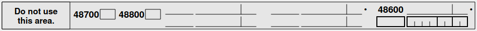

+++
date = "2023-02-01T00:00:00Z"
description = "Using the area labeled \"Do not use this area\""
tags = ["tax"]
title = "Secret lines on the Canadian income tax return"
draft = true
+++

On the last page of the [Canadian income tax return](https://www.canada.ca/content/dam/cra-arc/formspubs/pbg/5006-r/5006-r-22e.pdf#page=8) is an area labelled "Do not use this area":

## Box 48700

cvtip

## Box 48800

applying refund to installment payments

## Box 48600

amount enclosed
