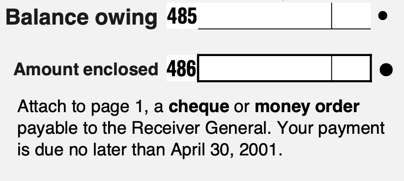

+++
date = "2026-04-12T00:00:01Z"
description = "what if we used the area labeled \"Do not use this area\"?"
tags = ["tax"]
title = "Secret fields on Canadian income tax returns"
+++

On the last page of the [Canadian income tax return](https://www.canada.ca/content/dam/cra-arc/formspubs/pbg/5006-r/5006-r-22e.pdf#page=8) is an area labelled "Do not use this area". Which makes you wonder: what are these lines for? why can't we write in them? what doesn't the Canada Revenue Agency want us to know?

Well I've figured out the answer! The CRA has some [documentation for developers of e-filing software](https://www.canada.ca/en/revenue-agency/services/forms-publications/publications/rc4018/chapter-1.html#toc22) that documents what these lines do, and I've combined that with some additional research to figure out what everything in that area is for.

## Box 48600

This is used for the amount of money enclosed with the tax return (e.g. if you include a cheque in the same envelope as the tax return). My guess is that whoever opens the envelopes at the CRA splits out the paper tax returns to one pile and the cheques to another pile, and then writes the amount of the cheque on line 48600. Older tax returns had this field for real underneath the amount owing:

## Box 48700

This box is checked if the return was prepared by a volunteer through the [Community Volunteer Income Tax Program](https://www.canada.ca/en/revenue-agency/services/tax/individuals/community-volunteer-income-tax-program.html). Presumably the CRA tells CVITP volunteers to check this box when preparing returns, so that they can have statistics on how many returns were prepared through the CVITP.

## Box 48800

This is called "refund transfer" in the e-file documentation, and lets you transfer your refund to pay for next year's instalments. The [CRA says](https://www.canada.ca/en/revenue-agency/services/tax/individuals/topics/about-your-tax-return/tax-return/completing-a-tax-return/deductions-credits-expenses/line-48400-refund.html) that the way you should request a refund transfer when paper-filing is by attaching a note to your return:

> You can ask the CRA to transfer your refund to your 2026 instalment account when you file your return electronically or by attaching a note to your paper return.

I guess this is an uncommon enough request that they didn't want to take up space on the tax return with instructions explaining how refund transfers work, but for some reason they still wanted to have the actual field somewhere?
