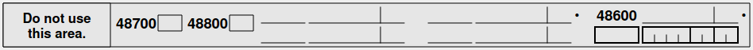

+++
date = "2026-04-12T00:00:00Z"
description = "what if we used the area labeled \"Do not use this area\""
tags = ["tax"]
title = "Secret lines on Canadian income tax returnS"
draft = true
+++

On the last page of the [Canadian income tax return](https://www.canada.ca/content/dam/cra-arc/formspubs/pbg/5006-r/5006-r-22e.pdf#page=8) is an area labelled "Do not use this area". Not a tax year goes by without me wondering: what are these lines for? Why can't we write in them? What doesn't the Canada Revenue Agency (CRA) want us to know?

Well I've figured out the answer! The CRA has some [documentation for developers of e-filing software](https://www.canada.ca/en/revenue-agency/services/forms-publications/publications/rc4018/chapter-1.html#toc22) that documents what these lines do, and I've done a bit of additional research to figure this out.

## Box 48700

This box is checked if the return was prepared by a volunteer through the [Community Volunteer Income Tax Program](https://www.canada.ca/en/revenue-agency/services/tax/individuals/community-volunteer-income-tax-program.html).

## Box 48600

This is the amount enclosed.

## Box 48800

This is used for applying refund to installment payments.
